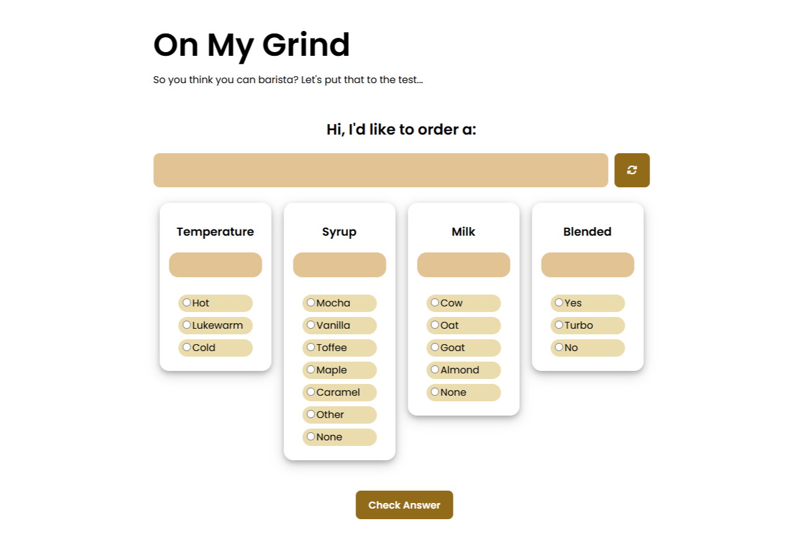

# ☕ On My Grind – CodePath WEB102 Lab 2

**On My Grind** is a memory-based quiz app inspired by Wordle — but for aspiring baristas! In this web application, users test their knowledge of real (and even discontinued 😉) Starbucks drinks by selecting the correct combination of temperature, syrup, milk, and blendedness. After making their selections, they can check their answers to see which elements are correct and continue generating more drinks to challenge themselves. Built as part of **CodePath's WEB102 Lab 2**.

## 🎯 Lab Objective
This lab focuses on:
- Handling and validating **form input** in React
- Building **controlled components**
- Using **arrays and objects** with `useState`
- Practicing **lifting state up** for component communication

## 🛠️ Tech Stack
- ⚛️ **React** – Functional components and hooks  
- ⚡ **Vite** – Development and bundling  
- 🟨 **JavaScript (ES6+)** – For state logic and interaction  
- 🎨 **CSS** – For styling the quiz interface

## 🧩 Features
- **Random Drink Generator**: Presents users with a new drink upon click the generate button
- **Answer Selection**: Users choose drink attributes (temperature, syrup, milk, blendedness)  
- **Answer Checking**: Reveals which selections were correct and incorrect  
- **Repeatable Gameplay**: Generate as many drinks as you want to keep testing your memory




## 📂 Project Structure
```
src/
├── App.css
├── App.jsx
├── components/
│ ├── BaristaForm.jsx
│ ├── BaristaForm.css
│ ├── drinks.json
│ ├── RecipeChoices.jsx
├── index.css
└── main.jsx
index.html
```

## 🚀 Getting Started
### 1. Clone the repo:
```
git clone https://github.com/sixthsenseriot/lab-03-on-my-grind.git
cd lab-03-on-my-grind
```

### 2. Install dependencies:
```
npm install
```

### 3. Run the app:
```
npm run dev
```

### 4. View it locally:
Open http://localhost:5173 in your browser.

## 📝 Author
Created by **Khanh Nguyen** as part of CodePath's WEB102 curriculum.

## 📄 License
This project is for educational purposes under CodePath's Web Development 102 curriculum. Open for personal and learning use.
